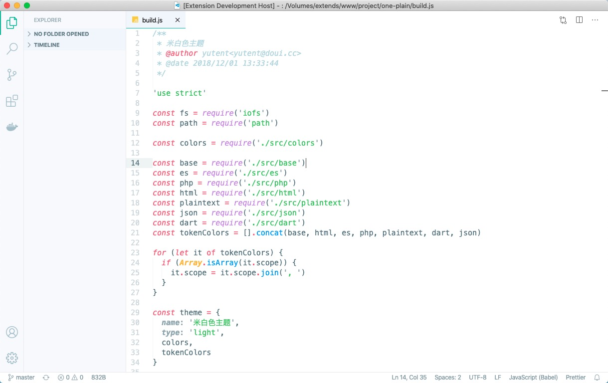

# 米白色主题(Theme)
> 米白色主题, vscode专用。包括UI和代码高亮, 都精心调整好对比度。优雅,耐看。 喜欢浅色系的童鞋, 不要错过。
>> 目前主题精心适配 `ts,js,scss,css,html,php,md,json`等语言的高亮, 其他语言适配, 如发现有不正常的高亮可以到[GitHub](https://github.com/yutent/one-plain.git)反馈, 我会第一时间适配。

## 截图预览

## 安装(Installation)
> 直接从插件管理器搜索`米白`下载即可。
> 想看我的所有的插件,可以搜索 `yutent`

## 问题(Issue)
> 有任何问题,或建议, 都可以到[GitHub](https://github.com/yutent/one-plain.git) 提出。

